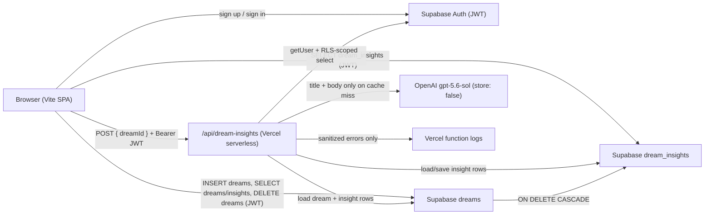

# DreamCatcher — Security & Privacy Alpha Gate

**Branch:** `security/privacy-alpha-gate`  
**Base:** `insight/recognition-v3-reevaluation` @ `3fc58142fae3f769f7bd3a07840bc7ae5c2f5eb6`  
**Date:** 2026-07-17  
**Scope:** Pre-external adult alpha — repository code review, minimal hardening, and verification. No Insight prompt/schema/model changes.

---

## Product lineage confirmation

| Check | Result |
|-------|--------|
| `insight/recognition-v3-reevaluation` contains `main` | Yes — merge-base with `main` is `95556fc` (current `main` HEAD) |
| Contains accepted UX/auth baseline | Yes — `ux-mobile-polish-v2` @ `3c22fad` is fully contained; insight branch adds one commit (`3fc5814`) |
| Accepted onboarding/mobile polish (`a52d8bf`) | Present in ancestry |

**Conclusion:** Branch ancestry is correct for the current functional product lineage. No speculative merges performed.

---

## Verified data flow

### Step-by-step

1. **Capture & save (client):** Authenticated user writes title/body in the SPA. Client inserts into `dreams` with `user_id = auth.uid()` via Supabase JS (publishable key + session JWT). Dream text stays in Supabase; not sent to OpenAI at save time.
2. **Journal load (client):** Client selects own `dreams` and related `dream_insights` rows. RLS restricts to `auth.uid() = user_id`.
3. **Insight generation (server):** Client POSTs only `dreamId` to `/api/dream-insights` with Bearer JWT. Server validates session, loads dream under caller JWT + explicit ownership check, returns cached insight if valid, otherwise calls OpenAI with dream title/body, validates JSON schema, upserts `dream_insights`.
4. **OpenAI:** Requests use `store: false` (`lib/insight-v2-openai.mjs`). Dream content is transmitted to OpenAI for generation only on cache miss.
5. **Logs:** API logs error labels and short safe metadata via `logServerError()` — no dream text, JWTs, or API keys. Client logs only Supabase error messages for insight load failures.
6. **Dream deletion:** Client deletes from `dreams` with `id` + `user_id` match. DB FK `dream_insights.dream_id → dreams.id ON DELETE CASCADE` removes orphaned insights (repository migration evidence).
7. **Account deletion:** **Not implemented** in app. Logout clears in-memory state only. Full erasure would require Supabase Auth user deletion (cascades via `user_id` FKs) — operator-mediated only today.

---

## Checks performed and why

| Check | Method | Why it matters for alpha |
|-------|--------|--------------------------|
| Auth + ownership on Insights API | Code review `api/dream-insights.js` | Prevents unauthenticated or cross-user insight generation |
| RLS policy definitions | Repository SQL migrations | Baseline for per-user isolation (not remote proof) |
| Server-only secrets | Grep + code review | `OPENAI_API_KEY` must not reach client bundle |
| Request method/body validation | Code review + guard test | Blocks malformed abuse and oversized payloads |
| Insight generation rate limits | Code fix + guard test | Limits OpenAI cost abuse by authenticated users |
| CORS tightening | Code fix + guard test | Reduces cross-site token misuse with permissive `*` |
| Dream deletion cascade | Migration review | Prevents orphaned insight rows after dream delete |
| Logging hygiene | Code review + grep | Dream content must not appear in logs |
| Generic client errors | Code review | Internal paths/DB details not returned to browser |
| Client save length limits | Code fix | Aligns save path with Insights cap; reduces unbounded storage |
| OpenAI `store: false` | Code review adapter | Reduces provider retention claim surface |
| Production build | `npm run build` | Ensures hardening does not break ship path |
| Dependency vulnerabilities | `npm audit --production` (non-mutating) | Known CVE baseline before external users |
| Secret-pattern scan | Grep eval outputs + repo | Accidental credential commit check |

**Explicitly not claimed:** Supabase production RLS policies, migration apply state, or Vercel env configuration were **not** remotely verified in this gate. Repository migrations are evidence only until confirmed in the Supabase Dashboard.

---

## Problems found (by severity)

### Critical — pre-fix

| # | Issue | Evidence |
|---|-------|----------|
| C1 | **No Insight generation rate limiting** — authenticated user could spam OpenAI | No limits in `api/dream-insights.js`; no `vercel.json` throttling |
| C2 | **No account/data erasure flow** | Profile UI: logout only; no delete-account path |

### High — pre-fix

| # | Issue | Evidence |
|---|-------|----------|
| H1 | **CORS reflected `*` when Origin missing** | `getCorsHeaders(origin \|\| "*")` |
| H2 | **Privacy claims unsupported by data flow** | UI: “Sheepy will keep it safe” — dreams sent to OpenAI for Insights; no in-app disclosure |
| H3 | **No user-facing privacy policy / subprocessor notice** | `PRODUCT.md`, `MARKETING.md` have no privacy section |

### Medium — pre-fix

| # | Issue | Evidence |
|---|-------|----------|
| M1 | **Unbounded dream save size** | Client insert had no max; Insights capped at 8000 chars only on API path |
| M2 | **No request body size limit** on Insights API | `readJsonBody` streamed unbounded |
| M3 | **Client could write `dream_insights` directly** (RLS allows insert/update for owner) | Migration policies; app does not use this path today |
| M4 | **Production RLS apply state unknown** | Migration comment: “Do not treat as applied until confirmed” |
| M5 | **Stack traces logged server-side** | `logServerError` emitted full stacks |

### Low — accepted limitations

| # | Issue | Notes |
|---|-------|-------|
| L1 | Password min 6 chars (client-only) | Supabase Auth defaults apply server-side |
| L2 | Committed eval fixtures contain sample dream text | Research artifacts; not runtime |
| L3 | Dead localStorage loader remains in `main.js` | Not used for cloud dreams |

---

## Fixes made (this branch)

| File | Change |
|------|--------|
| `api/dream-insights.js` | CORS allowlist (localhost, `*.vercel.app`, optional `ALLOWED_ORIGINS`); 4 KB request body cap; UUID `dreamId` validation; hourly (15) and daily (60) new-insight caps before OpenAI; removed stack trace logging |
| `src/main.js` | Client save limits: body ≤ 8000, title ≤ 200 chars |
| `supabase/migrations/20260717000000_dream_length_limits.sql` | DB constraints matching API caps (**repository only until applied**) |
| `scripts/security/test-dream-insights-guards.mjs` | Static guard verification |
| `package.json` | `test:security-insights-guards` script |

**Not changed (by design):** Insight prompt/schema/model, UI copy, account deletion UI, service-role Supabase pattern, production deploy.

---

## Verification results

| Step | Command / action | Result |
|------|------------------|--------|
| API syntax | `node --check api/dream-insights.js` | Pass (run at commit time) |
| Insight schema regression | `npm run test:insight-v2-schema` | Pass (unchanged Insight lib) |
| Security guards | `npm run test:security-insights-guards` | Pass |
| Production build | `npm run build` | Pass (run at commit time) |
| Dependency audit | `npm audit --production` | **0 vulnerabilities** (2026-07-17) |
| Secret-pattern scan | Grep `sk-`, `OPENAI_API_KEY=` in runtime paths | No matches in `api/`, `src/`, `lib/` |

---

## Remaining limitations

1. **Account deletion:** No self-service erasure. Alpha operators must delete users via Supabase Dashboard (Auth + cascade) on request.
2. **Privacy disclosure:** Product UI implies safety without stating OpenAI processing. Alpha requires **external consent copy** (email/doc) before onboarding testers.
3. **RLS remote state:** Migrations must be confirmed applied in production Supabase; length-limit migration is new and unapplied until operator runs it.
4. **`dream_insights` direct client writes:** Theoretically possible via Supabase client with user JWT; mitigated by app not using that path; full fix would need server-side service role or revoked insert/update policies plus API refactor.
5. **Rate limits:** Per-user DB counts reduce cost abuse but are not global IP throttling; sufficient for small closed alpha, not public launch.
6. **CORS:** Custom production domains must be added to `ALLOWED_ORIGINS` env var on Vercel.

---

## Privacy statements — honest claims

### DreamCatcher CAN honestly say (with current implementation)

- Dreams you save are stored in **your Supabase project**, scoped to your account.
- Only **you** can read, write, and delete your dreams through the app (assuming production RLS matches repository migrations).
- Dream Insights are generated **on demand**; the client sends only a dream id to our API; the server loads your dream text under your session.
- Generating an Insight sends that dream’s **title and text to OpenAI** for processing (`store: false` requested).
- Deleting a dream removes its stored Insight automatically (DB cascade).
- We do **not** embed your OpenAI API key in the client; generation runs server-side.
- Insight outputs are validated structured JSON before save; generic errors are shown on failure.

### DreamCatcher CANNOT honestly say (today)

- “Your dreams never leave our servers” — OpenAI receives dream text for Insights.
- “Fully private / encrypted end-to-end” — standard TLS + Supabase at rest; no E2E encryption.
- “We never use your dreams to train models” — depends on OpenAI enterprise/API terms; not independently audited here.
- “Delete your account anytime in the app” — not implemented.
- “Sheepy keeps dreams safe” as **absolute** safety — colloquial comfort copy, not a technical guarantee.
- Production security controls are verified — only repository evidence + local build/tests in this gate.

---

## Manual checks before first external alpha user

| Owner | Action |
|-------|--------|
| Supabase | Confirm `dreams` and `dream_insights` migrations applied; verify RLS enabled and policies match repo; apply `20260717000000_dream_length_limits.sql` |
| Supabase | Document operator SOP for account+dream deletion requests |
| Vercel | Confirm `OPENAI_API_KEY`, Supabase vars server-side only; set `ALLOWED_ORIGINS` for production domain |
| OpenAI | Confirm API key permissions and org data policies acceptable for alpha |
| Product | Provide written alpha consent mentioning Supabase storage + OpenAI Insight processing |
| Product | Replace or qualify “keep it safe” copy before public marketing (not required for closed alpha if consent doc covers it) |

---

## Final verdict

### **NOT READY**

Technical hardening on this branch closes several alpha-blocking code gaps (rate limits, CORS, validation, save caps, logging). **External adult alpha should not start** until:

1. Production Supabase RLS and migrations are **remotely confirmed**.
2. A **written alpha consent** discloses OpenAI processing and data storage.
3. An **operator account-deletion SOP** is in place (self-service deletion remains a post-alpha improvement).

Once those three manual items are complete, a **small, consenting-adult, operator-supported closed alpha** is acceptable from a security/privacy baseline perspective.

---

## Related files

- `api/dream-insights.js` — Insights API
- `lib/insight-v2-openai.mjs` — OpenAI adapter
- `src/main.js` — client dreams/insights/deletion
- `src/supabaseClient.js` — client Supabase init
- `supabase/migrations/20260711000000_create_dreams.sql`
- `supabase/migrations/20260713000000_create_dream_insights.sql`
- `supabase/migrations/20260717000000_dream_length_limits.sql`
