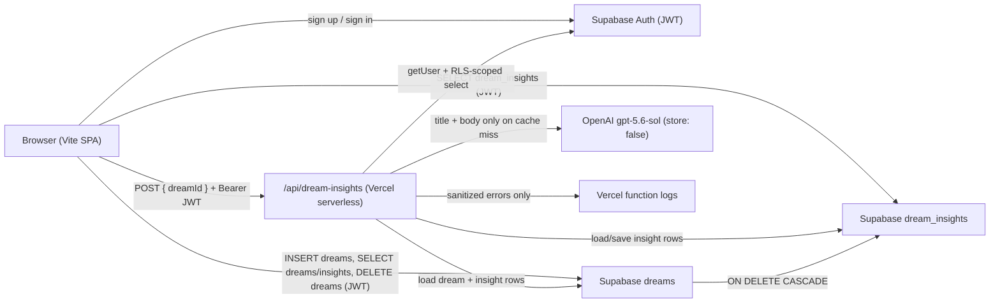

# DreamCatcher — Security & Privacy Alpha Gate

**Branch:** `security/privacy-alpha-gate`  
**Base:** `insight/recognition-v3-reevaluation` @ `3fc58142fae3f769f7bd3a07840bc7ae5c2f5eb6`  
**Date:** 2026-07-17  
**Scope:** Pre-external adult alpha — repository code review, minimal hardening, and verification. No Insight prompt/schema/model changes.

---

## Product lineage confirmation

| Check | Result |
|-------|--------|
| `insight/recognition-v3-reevaluation` contains `main` | Yes — merge-base with `main` is `95556fc` (current `main` HEAD) |
| Contains accepted UX/auth baseline | Yes — `ux-mobile-polish-v2` @ `3c22fad` is fully contained; insight branch adds one commit (`3fc5814`) |
| Accepted onboarding/mobile polish (`a52d8bf`) | Present in ancestry |

**Conclusion:** Branch ancestry is correct for the current functional product lineage. No speculative merges performed.

---

## Verified data flow



### Step-by-step

1. **Capture & save (client):** Authenticated user writes title/body in the SPA. Client inserts into `dreams` with `user_id = auth.uid()` via Supabase JS (publishable key + session JWT). Dream text stays in Supabase; not sent to OpenAI at save time.
2. **Journal load (client):** Client selects own `dreams` and related `dream_insights` rows. RLS restricts to `auth.uid() = user_id`.
3. **Insight generation (server):** Client POSTs only `dreamId` to `/api/dream-insights` with Bearer JWT. Server validates session, loads dream under caller JWT + explicit ownership check, returns cached insight if valid, otherwise calls OpenAI with dream title/body, validates JSON schema, upserts `dream_insights`.
4. **OpenAI:** Requests use `store: false` (`lib/insight-v2-openai.mjs`). Dream content is transmitted to OpenAI for generation only on cache miss.
5. **Logs:** API logs error labels and short safe metadata via `logServerError()` — no dream text, JWTs, or API keys. Client logs only Supabase error messages for insight load failures.
6. **Dream deletion:** Client deletes from `dreams` with `id` + `user_id` match. DB FK `dream_insights.dream_id → dreams.id ON DELETE CASCADE` removes orphaned insights (**remotely verified** in production).
7. **Account deletion:** **Not implemented** in app. Logout clears in-memory state only. Full erasure is operator-mediated via Supabase Auth user deletion; auth-user, dream, and Insight FKs were remotely verified with `ON DELETE CASCADE`. Approved procedure recorded below.

---

## Checks performed and why

| Check | Method | Why it matters for alpha |
|-------|--------|--------------------------|
| Auth + ownership on Insights API | Code review `api/dream-insights.js` | Prevents unauthenticated or cross-user insight generation |
| RLS policy definitions | Repository SQL migrations | Baseline for per-user isolation |
| Production RLS (remote) | User-confirmed production inspection | Proves live policies match ownership model |
| Length constraints (remote) | Preflight + applied production constraints | Caps body ≤ 8000 and title ≤ 200 in live DB |
| Cascade FKs (remote) | Production schema inspection | Auth user / dream / Insight deletion integrity |
| Vercel configuration | User-confirmed | Server env and ALLOWED_ORIGINS set for alpha |
| Preview smoke test | User-confirmed | Login, save, Journal/open, Insight, deletion |
| Adult-alpha disclosure + deletion SOP | Fabrizzio acceptance | Consent path and operator erasure for closed alpha |
| Server-only secrets | Grep + code review | `OPENAI_API_KEY` must not reach client bundle |
| Request method/body validation | Code review + behavioral guard tests | Blocks malformed abuse and oversized payloads (stream + parsed body) |
| Insight generation rate limits | Code fix + guard test | Best-effort saved-Insight quota; reduces casual OpenAI cost abuse |
| CORS tightening | Code fix + behavioral guard test | Exact ALLOWED_ORIGINS + localhost only; no `*` or `*.vercel.app` |
| Dream deletion cascade | Migration review | Prevents orphaned insight rows after dream delete |
| Logging hygiene | Code review + grep | Dream content must not appear in logs |
| Generic client errors | Code review | Internal paths/DB details not returned to browser |
| Client save length limits | Code fix | Aligns save path with Insights cap; reduces unbounded storage |
| OpenAI `store: false` | Code review adapter | Reduces provider retention claim surface |
| Production build | `npm run build` | Ensures hardening does not break ship path |
| Dependency vulnerabilities | `npm audit --production` (non-mutating) | Known CVE baseline before external users |
| Secret-pattern scan | Grep eval outputs + repo | Accidental credential commit check |

**Repository vs remote:** Repository migrations alone are not production proof. The **Remote production verification** section below records what was later confirmed live.

---

## Remote production verification (user-confirmed, 2026-07-17)

| Check | Result |
|-------|--------|
| Production RLS enabled for `dreams` | **Yes** |
| Production RLS enabled for `dream_insights` | **Yes** |
| Verified policies restrict rows to `auth.uid() = user_id` | **Yes** (all verified policies) |
| Existing data preflight — oversized dream bodies | **0** |
| Existing data preflight — oversized titles | **0** |
| Production length constraints applied and verified | **Yes** (body ≤ 8000, title ≤ 200) |
| Auth-user, dream, and Insight FKs with `ON DELETE CASCADE` | **Remotely verified** |
| Vercel configuration | **User-confirmed as set** |
| Preview smoke test | **Passed** — login, save, Journal/open, Insight generation, and deletion |
| Adult-alpha disclosure | **Fabrizzio explicitly accepted** (exact wording below) |
| Operator account-deletion procedure | **Fabrizzio explicitly accepted** (exact procedure below) |

**Access rule:** Each tester must receive the disclosure and **explicitly agree** before receiving access.

## Problems found (by severity)

### Critical — pre-fix

| # | Issue | Evidence |
|---|-------|----------|
| C1 | **No Insight generation rate limiting** — authenticated user could spam OpenAI | No limits in `api/dream-insights.js`; no `vercel.json` throttling |

### High — pre-fix

| # | Issue | Evidence |
|---|-------|----------|
| H1 | **CORS reflected `*` when Origin missing** | `getCorsHeaders(origin \|\| "*")` |
| H2 | **Privacy claims unsupported by data flow** | Mitigated for closed alpha by approved external disclosure + explicit agreement; still open for public marketing copy |
| H3 | **No user-facing privacy policy / subprocessor notice** | Closed alpha uses invitation disclosure; full policy still required before public launch |

### Medium — pre-fix

| # | Issue | Evidence |
|---|-------|----------|
| M1 | **Unbounded dream save size** | Client insert had no max; Insights capped at 8000 chars only on API path |
| M2 | **No request body size limit** on Insights API | `readJsonBody` streamed unbounded; parsed `req.body` also unchecked |
| M3 | **Client could write `dream_insights` directly** (RLS allows insert/update for owner) | Migration policies; app does not use this path today |
| M4 | **Production RLS apply state unknown** *(at initial audit)* | Later **remotely verified** — see Remote production verification |
| M5 | **Stack traces logged server-side** | `logServerError` emitted full stacks |

### Low — accepted for operator-supported closed alpha

| # | Issue | Notes |
|---|-------|-------|
| L1 | **No self-service account deletion** | Acceptable for closed alpha when a **verified operator deletion SOP** exists (Supabase Auth user delete + cascade). Self-service UI is a public-launch / post-alpha improvement, not Critical for this gate. |
| L2 | Password min 6 chars (client-only) | Supabase Auth defaults apply server-side |
| L3 | Committed eval fixtures contain sample dream text | Research artifacts; not runtime |
| L4 | Dead localStorage loader remains in `main.js` | Not used for cloud dreams |

---

## Fixes made (this branch)

| File | Change |
|------|--------|
| `api/dream-insights.js` | CORS: localhost + exact `ALLOWED_ORIGINS` only (no `*` / no `*.vercel.app`); 4 KB body cap on stream **and** pre-parsed `req.body`; UUID `dreamId` validation; best-effort saved-Insight quota (15/hour, 60/day); removed stack trace logging |
| `src/main.js` | Client save limits: body ≤ 8000, title ≤ 200 chars |
| `supabase/migrations/20260717000000_dream_length_limits.sql` | DB constraints matching API caps (**applied and verified in production**) |
| `scripts/security/test-dream-insights-guards.mjs` | Behavioral tests for parsed-body limits and origin acceptance |
| `package.json` | `test:security-insights-guards` script |

**Not changed (by design):** Insight prompt/schema/model, UI copy, account deletion UI, service-role Supabase pattern, production deploy, distributed/attempt-based rate limiting.

---

## Verification results

| Step | Command / action | Result |
|------|------------------|--------|
| API syntax | `node --check api/dream-insights.js` | Pass (run at commit time) |
| Insight schema regression | `npm run test:insight-v2-schema` | Pass (unchanged Insight lib) |
| Security guards | `npm run test:security-insights-guards` | Pass |
| Production build | `npm run build` | Pass (run at hardening commit time) |
| Dependency audit | `npm audit --production` | **0 vulnerabilities** (2026-07-17) |
| Secret-pattern scan | Grep `sk-`, `OPENAI_API_KEY=` in runtime paths | No matches in `api/`, `src/`, `lib/` |
| Remote Supabase / Vercel / smoke | User-confirmed (see above) | Pass — closes prior remote-verification gap |

---

## Approved adult-alpha disclosure

Fabrizzio explicitly accepted the following wording. Send it to each tester; they must explicitly agree before receiving access.

**DreamCatcher Adult Alpha**

DreamCatcher is an early test product for adults and is not a medical or mental-health service.

Dreams you save are stored with your DreamCatcher account using Supabase. When you request a Dream Insight, that dream’s title and text are sent to OpenAI for processing, and the resulting Insight is stored with your dream. Dream text is not sent to OpenAI merely by saving it.

Please avoid entering anything you do not want processed by these services. You can delete individual dreams inside the app. To delete your account and all associated dream data, reply to the message containing your alpha invitation. Deletion is currently handled manually.

Participation is voluntary, and you can stop at any time. By continuing, you confirm that you are at least 18 and consent to this described use of your data.

---

## Approved operator account-deletion procedure

Fabrizzio explicitly accepted the following procedure.

1. Confirm the request through the invitation channel and match it to the tester’s registered email.
2. In Supabase → Authentication → Users, locate the exact email and copy its user UUID.
3. Double-check the email and UUID before deleting.
4. Delete that Auth user. The verified database cascades will remove their dreams and Insights.
5. Confirm removal with:

```sql
select
  (
    select count(*)
    from public.dreams
    where user_id = 'REPLACE_WITH_USER_UUID'
  ) as dreams_remaining,
  (
    select count(*)
    from public.dream_insights
    where user_id = 'REPLACE_WITH_USER_UUID'
  ) as insights_remaining;
```

Expected result: `dreams_remaining = 0` and `insights_remaining = 0`.

---

## Remaining limitations

1. **Account deletion:** No self-service erasure in-app. Closed alpha uses the approved operator procedure above. Self-service UI remains a public-launch / post-alpha improvement.
2. **In-app privacy copy:** Product UI still implies safety (“keep it safe”) without stating OpenAI processing. Closed alpha mitigates this via the external disclosure + explicit agreement requirement; public marketing must still replace or qualify that copy.
3. **`dream_insights` direct client writes:** Theoretically possible via Supabase client with user JWT; mitigated by app not using that path; full fix would need server-side service role or revoked insert/update policies plus API refactor.
4. **Insight quota (best-effort):** Counts **saved** `dream_insights` rows only. Failed OpenAI calls and concurrent in-flight generations may bypass the cap. Sufficient for small closed alpha; **robust attempt-based throttling is a public-launch gate**.
5. **CORS:** Production and preview hosts must remain listed exactly in `ALLOWED_ORIGINS`. Same-origin SPA traffic does not require broad CORS. Do not rely on `*.vercel.app`.
6. **Not a public or paid launch:** This gate does not authorize open signup, paid tiers, broad marketing claims, or attempt-based abuse controls at launch scale.

---

## Privacy statements — honest claims

### DreamCatcher CAN honestly say (with current implementation)

- Dreams you save are stored in **your Supabase project**, scoped to your account.
- Only **you** can read, write, and delete your dreams through the app (production RLS enabled; verified policies use `auth.uid() = user_id`).
- Dream Insights are generated **on demand**; the client sends only a dream id to our API; the server loads your dream text under your session.
- Generating an Insight sends that dream’s **title and text to OpenAI** for processing (`store: false` requested).
- Deleting a dream removes its stored Insight automatically (DB cascade; remotely verified).
- We do **not** embed your OpenAI API key in the client; generation runs server-side.
- Insight outputs are validated structured JSON before save; generic errors are shown on failure.
- Closed-alpha testers receive the approved disclosure and must explicitly agree before access; account deletion is available via the operator procedure.

### DreamCatcher CANNOT honestly say (today)

- “Your dreams never leave our servers” — OpenAI receives dream text for Insights.
- “Fully private / encrypted end-to-end” — standard TLS + Supabase at rest; no E2E encryption.
- “We never use your dreams to train models” — depends on OpenAI enterprise/API terms; not independently audited here.
- “Delete your account anytime in the app” — not implemented; operator-mediated only.
- “Sheepy keeps dreams safe” as **absolute** safety — colloquial comfort copy, not a technical guarantee.
- “Ready for public or paid launch” — closed adult alpha only; see verdict.

---

## Manual checks before first external alpha user

| Owner | Action | Status |
|-------|--------|--------|
| Supabase | Confirm RLS enabled; policies `auth.uid() = user_id`; length constraints; cascade FKs | **Done** (user-confirmed remote verification) |
| Supabase | Operator account-deletion SOP | **Done** (approved procedure recorded above) |
| Vercel | Env / ALLOWED_ORIGINS configuration | **Done** (user-confirmed as set) |
| Product | Adult-alpha disclosure + explicit agreement before access | **Done** (approved wording; required per tester) |
| Product | Preview smoke: login, save, Journal/open, Insight, deletion | **Done** (passed) |
| Product | Replace or qualify “keep it safe” copy before **public** marketing | Still required before public launch |

---

## Final verdict

### **READY** for a small, consenting-adult, operator-supported closed alpha

### **Not ready** for a public or paid launch

Closed-alpha conditions now met: production RLS and ownership policies verified, length constraints applied after a clean preflight, cascade FKs verified, Vercel configuration user-confirmed, preview smoke passed, and Fabrizzio accepted the adult-alpha disclosure plus operator account-deletion procedure. Each tester must receive the disclosure and explicitly agree before receiving access.

Public or paid launch still requires (at minimum) in-app privacy copy correction, self-service or equivalently productized account deletion, and robust attempt-based Insight throttling.

---

## Related files

- `api/dream-insights.js` — Insights API
- `lib/insight-v2-openai.mjs` — OpenAI adapter
- `src/main.js` — client dreams/insights/deletion
- `src/supabaseClient.js` — client Supabase init
- `supabase/migrations/20260711000000_create_dreams.sql`
- `supabase/migrations/20260713000000_create_dream_insights.sql`
- `supabase/migrations/20260717000000_dream_length_limits.sql`
